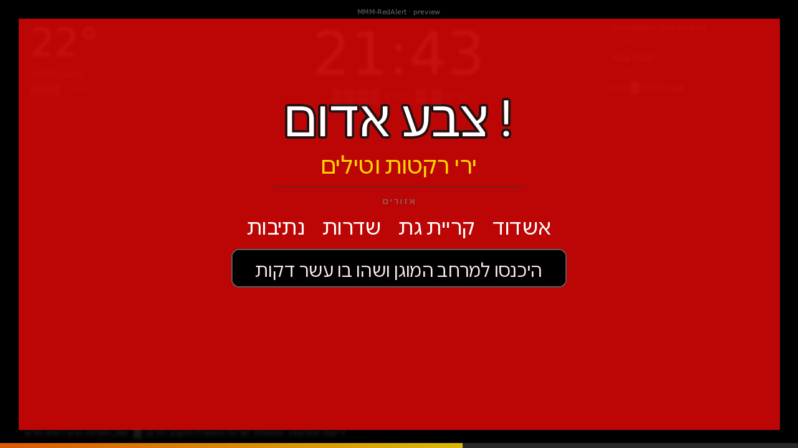

# MMM-RedAlert

A [MagicMirror²](https://magicmirror.builders) module that monitors Israeli missile alerts (**Tzeva Adom / צבע אדום**) in real-time using the official **Pikud HaOref** API.

When an alert is issued for your configured location, the module displays a prominent full-screen warning overlay on your mirror for **90 seconds** before automatically dismissing.



---

## ⚠️ Important Disclaimer

**This module is provided for informational and convenience purposes only.**

- **Do NOT rely on this module as your primary or sole source of emergency alerts.** Always keep the official **Pikud HaOref app** installed and enabled on your mobile device — [iOS](https://apps.apple.com/il/app/israel-home-front-command/id1542010719) · [Android](https://play.google.com/store/apps/details?id=com.alert.meserhadash).
- This module depends on network connectivity, the availability of the Pikud HaOref API, and correct functioning of your Raspberry Pi. Any of these can fail silently.
- Alerts may be delayed, missed, or filtered out due to misconfiguration, network issues, API changes, or software bugs.
- **The authors and contributors of this module accept no responsibility or liability for missed alerts, delayed alerts, or any consequences — including personal injury or property damage — arising from the use or failure of this software.**
- In an emergency, always follow the instructions of the **Israel Home Front Command (פיקוד העורף)**. Official resources: [oref.org.il](https://www.oref.org.il) | Emergency hotline: **104**

By installing and using this module, you acknowledge that it is a supplementary display tool and not a life-safety system.

---

## Features

- Real-time polling of the official Pikud HaOref API (every 2 seconds)
- Filters alerts by **your specific city or area**
- Filters by **alert category** (missiles, hostile aircraft, terrorist infiltration, etc.)
- Full-screen pulsing red overlay with slide-in animation
- Shows **affected cities**, **alert type**, and **safety instructions** in Hebrew
- **Countdown progress bar** showing time remaining before auto-dismiss
- Auto-dismisses after 90 seconds (configurable)
- Deduplication — same alert won't re-trigger while it's active
- Zero npm dependencies (uses Node.js built-in `https`)

---

## Requirements

- MagicMirror² v2.15 or later
- Node.js v16 or later
- The Pi / server must be on an **Israeli IP address** — the Pikud HaOref API is geo-restricted to Israel

---

## Installation

```bash
cd ~/MagicMirror/modules
git clone https://github.com/Moran-k/MMM-RedAlert.git
cd MMM-RedAlert
npm install
```

Then add the module to your `config/config.js` and restart MagicMirror.

---

## Update

```bash
cd ~/MagicMirror/modules/MMM-RedAlert
git pull
npm install
pm2 restart MagicMirror
```

---

## Configuration

Add a block like this to your `config/config.js`:

```javascript
{
  module: "MMM-RedAlert",
  position: "fullscreen_above",
  config: {
    locations: ["אשדוד", "קריית גת"],
    categories: [1, 2, 6, 10, 13],
    pollInterval: 2000,
    displayDuration: 90000,
  },
}
```

### Config Options

| Option | Type | Default | Description |
|--------|------|---------|-------------|
| `locations` | `string[]` | `["*"]` | Hebrew city/area names to watch. Use `["*"]` for all of Israel. Partial match supported — `"תל אביב"` matches `"תל אביב - מרכז העיר"`. |
| `categories` | `number[]` | `[1, 2, 6, 13]` | Alert categories to show. Empty array = all. See table below. |
| `pollInterval` | `number` | `2000` | API polling interval in milliseconds. |
| `displayDuration` | `number` | `90000` | How long to show the alert (ms). Default is 90 seconds. |
| `alertTitle` | `string` | `"🚨 צבע אדום"` | Title text shown on the overlay. |
| `showLocations` | `boolean` | `true` | Show the list of affected cities. |
| `showInstructions` | `boolean` | `true` | Show Pikud HaOref safety instructions. |
| `animateEntry` | `boolean` | `true` | Slide-in animation when alert appears. |
| `debug` | `boolean` | `false` | Log polling details to the console. |

### Alert Categories

| Code | Type |
|------|------|
| `1` | Missiles and rockets (צבע אדום) |
| `2` | Hostile aircraft intrusion |
| `3` | Earthquake |
| `4` | Tsunami |
| `5` | Radiological event |
| `6` | Terrorist infiltration |
| `7` | Hazardous materials |
| `10` | News flash |
| `13` | Non-conventional missile |

---

## Example — Specific City

```javascript
{
  module: "MMM-RedAlert",
  position: "fullscreen_above",
  config: {
    locations: ["תל אביב", "רמת גן", "גבעתיים"],
    categories: [1, 2, 13],
    displayDuration: 90000,
  },
}
```

## Example — All of Israel

```javascript
{
  module: "MMM-RedAlert",
  position: "fullscreen_above",
  config: {
    locations: ["*"],
    categories: [1],
  },
}
```

---

## Data Source

This module uses the **official Pikud HaOref (Home Front Command)** API:

```
GET https://www.oref.org.il/WarningMessages/alert/alerts.json
```

- Returns active alert JSON when sirens are active, empty response when quiet
- Requires `Referer` and `X-Requested-With` headers
- **Geo-restricted to Israeli IP addresses**
- No authentication required

---

## How It Works

1. `node_helper.js` polls the Pikud HaOref API every `pollInterval` milliseconds
2. When an alert is returned, it checks if any alerted city matches your `locations` config and if the category is in your `categories` list
3. If matched and not already shown (dedup by alert ID), it sends a socket notification to the frontend
4. `MMM-RedAlert.js` renders the overlay and starts the auto-dismiss timer
5. After `displayDuration` ms, the overlay fades out

---

## Troubleshooting

**No alerts showing during an actual alert?**
- Check that your Pi is on an Israeli IP address (the API is geo-blocked)
- Enable `debug: true` to see polling logs in the browser console
- Verify your `locations` strings exactly match Pikud HaOref city names (check [oref.org.il](https://www.oref.org.il))

**High CPU on Pi?**
- Increase `pollInterval` to `3000` (3 seconds) — still fast enough for real alerts

---

## License

MIT © [Moran Kalmanovich](https://github.com/Moran-k)
